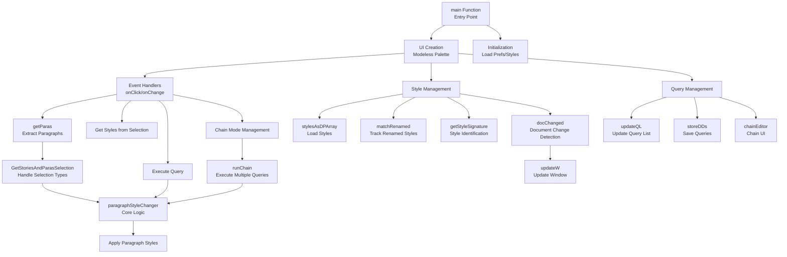

# Agent Guide: paragraphStyleChanger

## ⚠️ VERSIONING POLICY - READ FIRST

**Before making ANY changes, you MUST:**

1. **Assess if the change warrants a new version number:**
   - Bug fixes → Increment patch version (e.g., 2.84 → 2.85)
   - New features → Increment minor version (e.g., 2.84 → 2.90)
   - Breaking changes → Increment major version (e.g., 2.84 → 3.00)

2. **If version increment is needed:**
   - **FIRST**: Copy current version to `last_version/` folder:
     ```bash
     cp paragraphstylechanger2-XX.jsx last_version/paragraphstylechanger2-XX.jsx
     ```
   - **THEN**: Update version number in two places:
     - Line 6: `var ScriptVersion = '2.XX';`
     - Line 10: `paragraphStyleChanger.jsx | v.2.XX`
   - **ALSO**: Update filename: `paragraphstylechanger2-XX.jsx`
   - **COMMIT**: Version increment as separate commit before making changes
   - **UPDATE**: README.md changelog section with new version entry; Line 50 in `AGENTS.md`

3. **Versioning best practices:**
   - Follow semantic versioning (MAJOR.MINOR.PATCH)
   - Always preserve previous version in `last_version/` before major changes
   - Document changes in README.md changelog
   - Tag releases in Git: `git tag v2.XX`

---

## Project Overview

**paragraphStyleChanger** is an Adobe InDesign script that finds and replaces paragraph style combinations. Unlike InDesign's built-in Find/Change dialog, it specializes in matching **consecutive paragraph style patterns** and provides a persistent, modeless palette for rapid style experimentation.

### Key Capabilities

- **Conditional Style Matching**: Find paragraphs based on their style AND adjacent paragraph styles
- **Chainable Queries** (v2.82+): Execute multiple find/change tasks in sequence
- **Modeless Palette**: Stays open while working, auto-updates when switching documents
- **Smart Style Tracking**: Handles renamed/moved styles by matching name and unique ID
- **Saveable Queries**: Store frequently used style combinations per document
- **Bilingual**: English and German localization
- **Adaptive UI**: Matches InDesign's light/dark theme

### Current Version

- **Version**: 2.85
- **Last Updated**: January 2026
- **File**: `paragraphstylechanger2-85.jsx`

---

## Architecture Overview



---

## Core Functions & Entry Points

### Main Entry Point

**`main()`** (Line 4)
- Entry point for the script
- Initializes UI, preferences, event handlers
- Sets up modeless palette window
- **When to modify**: Only for major structural changes

### Core Logic Functions

**`paragraphStyleChanger(ps)`** (Line 2204)
- **Purpose**: Core find/replace logic for paragraph styles
- **Parameters**: `ps` - collection of paragraphs to process
- **Returns**: `{matches: number, changed: number}`
- **Logic**: Implements 13 different matching patterns for style combinations
- **When to modify**: Changes to matching logic, new pattern types

**`getParas()`** (Line 2021)
- **Purpose**: Extracts paragraphs from current selection
- **Returns**: Array of paragraphs to process
- **Handles**: Documents, layers, text frames, tables, pages, nested structures
- **When to modify**: Support for new selection types

**`GetStoriesAndParasSelection(sts, ps, sel)`** (Line 2114)
- **Purpose**: Recursively extracts stories and paragraphs from complex selections
- **Parameters**: 
  - `sts` - stories array
  - `ps` - paragraphs array
  - `sel` - selection object
- **When to modify**: Handling of nested objects, anchored frames, groups

### Style Management

**`stylesAsDPArray()`** (Line 1776)
- **Purpose**: Loads all paragraph styles as data provider array
- **Returns**: Array of style objects with `{id, name, notFound}` properties
- **When to modify**: Style loading logic, filtering

**`matchRenamed()`** (Line 1827)
- **Purpose**: Matches renamed/moved styles by unique ID
- **Updates**: Saved queries when styles are renamed
- **When to modify**: Style tracking improvements

**`getStyleSignature(style)`** (Line 1919)
- **Purpose**: Creates unique signature for style identification
- **Returns**: String signature combining name and ID
- **When to modify**: Style identification logic

**`stylesChanged(_cachedSignatures)`** (Line 1980)
- **Purpose**: Detects if styles have changed since last check
- **When to modify**: Change detection logic

### Query Management

**`updateQL(sourceDoc)`** (Line 1705)
- **Purpose**: Updates query list dropdown from document script labels
- **When to modify**: Query loading/saving logic

**`storeDDs(lbl, i)`** (Line 1734)
- **Purpose**: Saves current dropdown selections to document script label
- **When to modify**: Query persistence format

**`getCurrentDDs()`** (Line 1759)
- **Purpose**: Gets current dropdown selections
- **Returns**: `{ffp, fsp, cfp, csp}` - find/change style objects
- **When to modify**: UI state reading

### Chain Mode (v2.82+)

**`runChain(chain)`** (Line 1154)
- **Purpose**: Executes multiple queries in sequence
- **Parameters**: `chain` - array of query objects
- **When to modify**: Chain execution logic, error handling

**`chainEditor(existingChain)`** (Line 1539)
- **Purpose**: UI dialog for editing query chains
- **When to modify**: Chain management UI

**`enterChainMode(cachedState)`** (Line 1411)
- **Purpose**: Enters chain mode, disables certain UI elements
- **When to modify**: Chain mode behavior

**`exitChainMode()`** (Line 1446)
- **Purpose**: Exits chain mode, restores UI
- **When to modify**: Chain mode cleanup

### UI Update Functions

**`updateW()`** (Line 1401)
- **Purpose**: Updates entire window (styles, queries, selection info)
- **When to modify**: UI refresh logic

**`updateSelectionInfo()`** (Line 1383)
- **Purpose**: Updates selection info text display
- **When to modify**: Selection display logic

**`updateDoButtonEnabled()`** (Line 1392)
- **Purpose**: Enables/disables "Do it!" button based on state
- **When to modify**: Button state logic

### Document Event Handlers

**`docChanged()`** (Line 1908)
- **Purpose**: Called when document changes detected
- **Triggers**: Style list refresh, query updates
- **When to modify**: Document change handling

**`handleAfterActivate(theEvent)`** (Line 1362)
- **Purpose**: Handles window activation events
- **When to modify**: Window focus handling

**`installLayerEvent()`** (Line 1345)
- **Purpose**: Installs layer change event handler
- **When to modify**: Layer change detection

### Utility Functions

**`loadPrefs()`** (Line 1998)
- **Purpose**: Loads preferences from settings file
- **When to modify**: Preference format changes

**`savePrefs()`** (Line 2010)
- **Purpose**: Saves preferences to settings file
- **When to modify**: Preference persistence

**`getNestingPath(s)`** (Line 2184)
- **Purpose**: Gets nested path string for style groups
- **When to modify**: Style group display format

**`log(s)`** (Line 2353)
- **Purpose**: Logging utility (file or console)
- **When to modify**: Logging format, destinations

---

## Key Data Structures

### Query List Item (`QL_item`)
```javascript
{
    name: "Query Name",
    set: {
        ffp: {id: number, name: string},  // Find first paragraph style
        fsp: {id: number, name: string},  // Find second paragraph style
        cfp: {id: number, name: string}, // Change first paragraph style
        csp: {id: number, name: string}  // Change second paragraph style
    }
}
```

### Chain Structure
```javascript
[
    {name: "Query 1", set: {...}},
    {name: "Query 2", set: {...}},
    ...
]
```

### Preferences (`_prefs`)
```javascript
{
    autoRev: boolean,      // Auto-reverse last styles
    autoFind: boolean,     // Use change styles as find styles
    startFind: boolean,    // Start with selection styles
    useLayer: boolean,     // Use layer instead of document
    location: [x, y]       // Window position
}
```

---

## Common Modification Patterns

### Adding a New Feature

1. **Version check**: Does this warrant a version bump?
2. **Backup**: Copy current version to `last_version/`
3. **Increment version**: Update ScriptVersion, `__readMe` header, and filename
4. **Implement**: Add feature following existing patterns
5. **Test**: Verify with various selection types
6. **Document**: Update README.md changelog and AGENTS.md version info
7. **Commit & Tag**: Commit changes, create git tag `v2.XX`
8. **Push to Remote**: `git push origin main && git push origin v2.XX`

### Fixing a Bug

1. **Version check**: Usually patch increment (2.85 → 2.86)
2. **Backup**: Copy to `last_version/` if major fix
3. **Fix**: Identify root cause, apply fix
4. **Test**: Test affected scenarios
5. **Document**: Update README.md changelog and AGENTS.md version info
6. **Commit & Tag**: Commit changes, create git tag `v2.XX`
7. **Push to Remote**: `git push origin main && git push origin v2.XX`

### Modifying UI

- UI creation: Lines ~250-500
- Event handlers: Lines ~490-1330
- Update functions: Lines 1383-1410
- **Note**: UI uses ScriptUI, follows InDesign palette patterns

### Modifying Style Matching Logic

- Core logic: `paragraphStyleChanger()` (Line 2204)
- 13 matching patterns implemented
- Each pattern handles different combinations of:
  - `ffp` (find first paragraph) - can be null for "any style"
  - `fsp` (find second paragraph) - can be null for "any style"
  - `cfp` (change first paragraph) - can be null for "don't change"
  - `csp` (change second paragraph) - can be null for "don't change"

---

## Important Notes for Development

### Selection Handling
- Script handles: documents, layers, text frames, tables, pages, nested structures
- Uses `GetStoriesAndParasSelection()` for recursive extraction
- Blank line paragraphs cannot be processed (InDesign limitation)

### Style Tracking
- Styles tracked by both name and unique ID
- Renamed styles automatically matched via ID
- Missing styles marked with `(Missing)` prefix

### Document Persistence
- Queries stored in document script labels
- Preferences stored in `~paragraphstylechanger2-XX_settings.txt`
- Script labels create hidden undo steps

### Event Handling
- Uses event handlers instead of idle tasks (v2.80+)
- Window activation triggers updates
- Layer changes trigger updates
- Document changes trigger style refresh

### Localization
- Uses `localize()` function for English/German
- All UI strings localized
- Error messages localized

---

## Testing Considerations

When modifying the script, you have no way to interact with Indesign. Give the user instructions on what to test concerning the changes.

---

## File Structure

```
paragraphstylechanger/
├── paragraphstylechanger2-85.jsx    # Current version (ROOT)
├── README.md                         # User documentation
├── LICENSE                           # MIT License
├── AGENTS.md                         # This file
├── .gitignore                        # Git ignore rules
├── icons/
│   └── v3/                           # Final icons (tracked)
├── last_version/                     # Recent versions (tracked)
│   ├── paragraphstylechanger2-80.jsx
│   ├── paragraphstylechanger2-81.jsx
│   ├── paragraphstylechanger2-82.jsx
│   └── paragraphstylechanger2-83.jsx
└── [gitignored:]
    ├── _archive/                     # All old versions
    ├── icons/_dump/                  # Icon source material
    ├── icons/v2/                     # Old icon versions
    ├── resources/                    # Development resources
    └── tests/                        # Test files
```

---

## References

- **Key techniques**: Marc Autret's ScriptUI patterns
- **ScriptUI sprites**: Marc Autret's sprite button implementation
- **Dropdown management**: Marc Autret's prototypal dropdown management

---

## Quick Reference: Version Update Checklist

- [ ] Determine if change warrants version increment
- [ ] Copy current file to `last_version/paragraphstylechanger2-XX.jsx`
- [ ] Update `ScriptVersion` variable (Line 6)
- [ ] Update version in `__readMe` string (Line 10)
- [ ] Rename file to new version number
- [ ] Update README.md changelog (version header + changelog table)
- [ ] Commit version increment separately
- [ ] Make feature/bugfix changes
- [ ] Test thoroughly
- [ ] Commit changes
- [ ] Tag release: `git tag v2.XX`
- [ ] Push commits to remote: `git push origin main`
- [ ] Push tag to remote: `git push origin v2.XX`
- [ ] In `AGENTS.md` update version number and documentation of added or changed core functions or file structure
