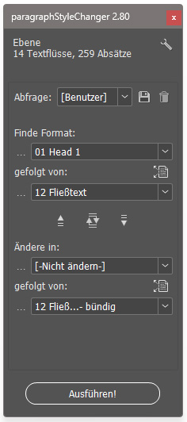
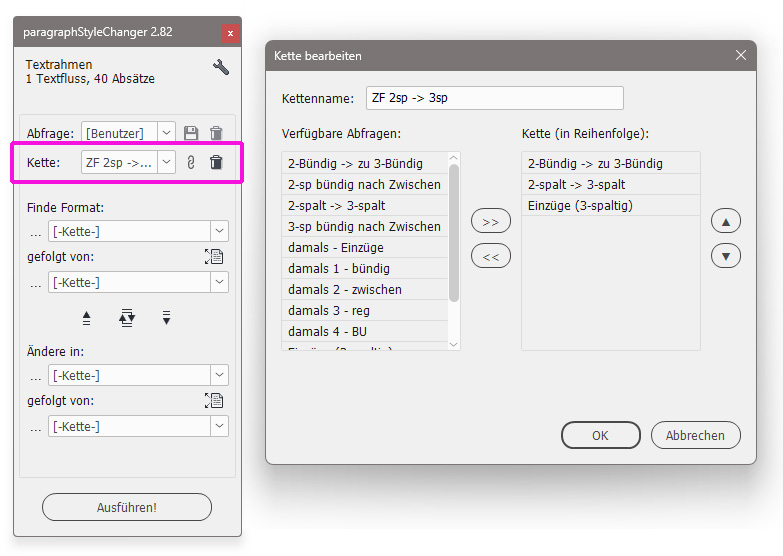

# paragraphStyleChanger.jsx

**A powerful Adobe InDesign script for finding and replacing paragraph style combinations.**

> Version 2.82 | by Stephan Möbius | December 2025

---

## Overview

paragraphStyleChanger is an InDesign script that finds and applies **conditional combinations** of paragraph styles comfortably in almost any kind of selection. Unlike InDesign's built-in Find/Change dialog, this script specializes in matching **consecutive paragraph style patterns** and provides a persistent, modeless palette for rapid style experimentation.

### Key Features

- **Conditional Style Matching**: Find paragraphs based on their style AND the style of adjacent paragraphs
- **Chainable Queries** (v2.82): Execute multiple find/change tasks in sequence with a single click for complex task automation
- **Modeless Palette**: Stays open while you work, updates automatically when switching documents
- **Smart Style Tracking**: Handles renamed and moved styles by matching both name and unique ID
- **Saveable User Queries**: Store frequently used style combinations per document
- **Bilingual Interface**: English and German localization
- **Adaptive UI**: Matches InDesign's interface color theme (light/dark)

---

## Screenshots

| Main Interface (Dark Theme) | Chainable Queries (v2.82) |
|:---------------------------:|:-------------------------:|
|  |  |

*Left: The palette adapts to InDesign's color scheme. Right: New in v2.82 – manage chains of find/change queries and execute multiple in sequence.*

---

## Installation

1. Download `paragraphstylechanger2-82.jsx`
2. Place the file in your InDesign Scripts folder:
   - **Windows**: `C:\Users\[Username]\AppData\Roaming\Adobe\InDesign\Version [XX]\[Locale]\Scripts\Scripts Panel\`
   - **macOS**: `~/Library/Preferences/Adobe InDesign/Version [XX]/[Locale]/Scripts/Scripts Panel/`
3. In InDesign, open the Scripts panel (Window → Utilities → Scripts)
4. Double-click the script to run

---

## Usage Examples

### Simple Case
Find each paragraph with style **'X'**, change it to style **'Y'** — faster than the Find/Change dialog.

### Conditional Case
Find every occurrence of **'Heading' followed by 'Subheading'** and change it to **'Heading2' followed by 'Subheading-Alt'**.

### Auto-Reverse Mode
Compare two style combinations back and forth quickly for A/B layout testing.

### Quick Test Mode
After a run, the 'change to'-styles automatically become the new 'find'-styles, enabling rapid serial testing of layout variations.

### Get Styles
Click 'Get Styles' to fetch paragraph styles from your current selection directly into the dropdowns.

### Alternating Patterns
Create patterns like A-B-A-B-A using the special mode: find **[Any Style] followed by [Any Style]** → change to **Style-A followed by Style-B**.

### No-Style Workflow
Set paragraphs to **[No Paragraph Style]** to temporarily break their link to a style. Later, find and reassign all _unlinked_ paragraphs as a condition. (Can be very handy!)

---

## Supported Selections

The script intelligently handles many selection types:

- **Nothing selected**: Applies to the active document or active layer (configurable)
- **Insertion point or text frame**: Applies to the entire parent story, including anchored objects
- **Text on paths**: Works with text on lines, polygons, and other path items
- **Multiple page items**: Processes stories from all selected text frames and groups
- **Selected text range**: Processes only paragraphs within the selection
- **Tables**: Works with selected cells, rows, columns, or entire tables
- **Pages**: Works with pages selected via the Page tool
- **Nested structures**: Handles tables within tables, anchored frames within groups, etc.

---

## Settings & Storage

### Document-Specific Data
- User queries and dropdown selections are stored in a script label within each document
- Use "Remove Label" to delete all stored queries (this is undoable)

### Global Preferences
- Settings (wrench icon) are stored in a text file next to the script
- The file `~paragraphstylechanger2-82_settings.txt` can be deleted anytime; defaults will be recreated

### Import Queries
- Transfer saved queries from other documents using the import feature (v2.77+)

---

## Important Notes

### Paragraph Style Overrides
Local character overrides (text style ranges) are preserved, but **paragraph style overrides are lost** when applying a new paragraph style — this is standard InDesign behavior.

### Blank Line Paragraphs
The script cannot find or change blank line end-paragraphs (single carriage returns). InDesign's scripting model does not treat these as valid paragraphs.

### Undo Behavior
All changes are grouped into a single undo step. However, saving user queries creates a hidden undo step — be cautious when undoing multiple steps.

### Floating Palettes Issue
When using floating (non-docked) InDesign panels, the script may not detect window focus changes. Click in the document window then back to paragraphStyleChanger to force an update.

---

## Changelog

| Version | Date | Changes |
|---------|------|---------|
| **2.82** | Dec 2025 | New feature: Chainable queries for running multiple find/change tasks at once |
| **2.81** | Aug 2025 | Fixed Mac performance issues; Fixed style renaming detection bug |
| **2.80** | Aug 2025 | Fixed EventHandler errors; Replaced idleTask with proper event handling |
| **2.79** | Feb 2025 | New: Transfer user queries from other documents |
| **2.78** | Feb 2025 | Fixed crashes with faulty fonts; Improved script label handling |
| **2.77** | Sep 2024 | Import queries from older script versions |
| **2.76** | Apr 2022 | Bugfixes for nested objects |
| **2.74** | Apr 2022 | Extended support for nested objects |
| **2.00** | May 2018 | Complete UI rewrite with modeless dialog, smart style tracking, page selection support |
| **1.11** | Mar 2017 | Bugfix and improved style preloading |
| **1.1** | Mar 2017 | Nested style groups, multiple selections, table support, two languages |
| **1.0** | May 2013 | Initial release based on Thomas Silkjær's 2009 script |

---

## Credits

- **Original concept**: Based on "Fix paragraph style combinations" by Thomas Silkjær (2009)
- **Special thanks**: Marc Autret and Peter Kahrel for their invaluable posts, documentation, and examples

---

## Support & Donations

If this script saves you time regularly, please consider a small donation via PayPal:  
**stephan.moebius@gmail.com**

For feedback, bug reports, or feature requests, feel free to get in touch!

---

## License

MIT License – see [LICENSE](LICENSE) file for details.

